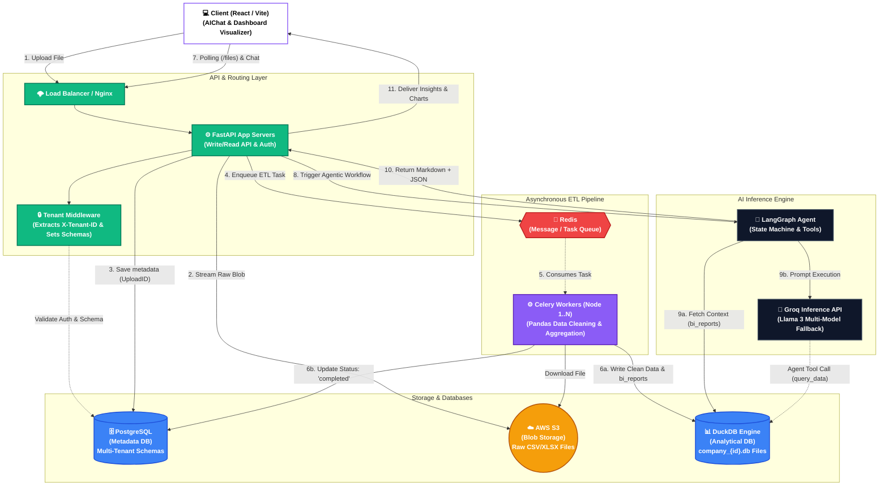

# Bizlytics: Comprehensive Technical Architecture & Deep-Dive Guide

## 1. System Design Architecture Diagram

Below is the complete, high-level system design diagram of the Bizlytics platform. It maps out the asynchronous, decoupled environment designed to process massive analytical datasets without blocking the main web servers.



---

## 2. Executive Summary

Bizlytics is an enterprise-grade, Multi-Tenant Software-as-a-Service (SaaS) Business Intelligence platform. Its primary objective is to allow corporate teams (HR, Sales, Operations) to upload large, unstructured datasets and instantly analyze them through an autonomous Agentic Artificial Intelligence assistant. 

Unlike traditional platforms that force users to drag-and-drop metrics, Bizlytics operates on a "Chat-to-Dashboard" paradigm. The system autonomously reads the data, cleans it, calculates baseline aggregations, and provides a multi-model Generative AI interface that constructs visual React dashboards on the fly based on conversational prompts.

This document serves as the absolute source of truth for the platform. By reading this, any developer, architect, or stakeholder will understand the complete flow of data from the moment a user clicks "Login" to the exact rendering of an SVG pie chart on the frontend.

---

## 3. Technology Stack Breakdown

### 3.1 Backend & Infrastructure
*   **FastAPI (Python 3.10+)**: Chosen for its high-performance asynchronous event loop (ASGI) and native Pydantic data validation.
*   **PostgreSQL**: The relational database used strictly for metadata (Users, Roles, Organizations, Upload Logs).
*   **DuckDB**: An incredibly fast in-process analytical database (OLAP). Used specifically for performing complex `GROUP BY` and `SUM` operations across millions of spreadsheet rows in milliseconds.
*   **Celery & Redis**: The background processing engine. Redis handles the message queues in RAM, and Celery executes the heavy data lifting.
*   **AWS S3 (Boto3)**: Cloud Object Storage. Files uploaded by users are never saved to the core web server's hard drive; they are piped directly to S3.
*   **LangGraph & Groq**: The AI orchestration framework. LangGraph builds cyclic execution loops (agents), and Groq executes the Llama-3 models at high speed.

### 3.2 Frontend
*   **React 18 & Vite**: Component-based frontend architecture bundled via Vite for extreme development/build speeds.
*   **TailwindCSS**: CSS framework customized heavily for "premium glassmorphism" dark-mode aesthetics.
*   **Recharts**: The composable charting library that transforms AI JSON outputs into interactive SVG element graphs.

---

## 4. Database Architecture & Multi-Tenancy

Data leakage between corporate clients in a SaaS application is catastrophic. Bizlytics employs a "Dual-Engine" architecture to isolate data tightly.

### 4.1 PostgreSQL: The Metadata Engine
PostgreSQL is strictly organized into schemas.
1.  **The `public` Schema**: Contains tables that span the entire application.
    *   `users`: Contains every email and hashed password on the platform. It maps users to a specific `schema_name`.
    *   `companies`: Tracks overarching company accounts and verifies them via `CompanyStatus` (pending, approved).
2.  **The Tenant Schemas (e.g., `company_apple_inc`)**: Generated dynamically when a new company registers. Each schema receives its own cloned set of tables:
    *   `hr_accounts`: The profiles of sub-users managing the dashboard.
    *   `raw_uploads`: The log of every CSV/XLSX file submitted by this company.

### 4.2 DuckDB: The Analytical Engine
DuckDB does not use PostgreSQL's architecture. Instead, it relies on **File-Based Isolation**.
*   When "Company 1" uploads a file, DuckDB generates a physical `.db` binary file on the server (or mounted volume) named precisely `data/analytics/company_1.db`.
*   Therefore, an AI query executing for Company 1 physically cannot query Company 2’s data, because it connects to an entirely different file lock.

### 4.3 The Magic of `tenant_middleware`
In `app/middleware/tenant.py`, an asynchronous function sits before all API routes:
1.  Extracts `X-Tenant-ID` from the incoming HTTP request.
2.  Instantiates `db = SessionLocal()`.
3.  Injects the string into a Postgres command: `SET search_path TO {tenant}, public`.
4.  Consequently, when an endpoint runs `db.query(RawUpload).first()`, Postgres automatically looks inside the `company_abc` schema, naturally securing the application without developers needing to filter `WHERE company_id = X` on every single query.

---

## 5. Security & Authentication Lifecycles

Bizlytics relies on stateless JSON Web Tokens (JWT) for authentication.

### 5.1 Token Mechanics
When a user calls `/login`, `app/core/jwt_handler.py` generates two tokens:
*   **Access Token (30m expiry)**: The frontend stores this in memory and attaches it to every API call. It contains the user's `user_id`, `role`, and `schema_name`.
*   **Refresh Token (7d expiry)**: A hashed copy of this secure string is saved to Postgres (`refresh_tokens` table) and passed to the frontend.
*   If a user must be instantly banned, the database flips `revoked = True` on their token, instantly terminating their session when the Access token lapses.

### 5.2 The Registration Flow (RBAC)
There are two distinct user roles: **Company Level** and **HR Level**.
1.  **Company Registration (`register_company`)**: 
    *   Strips the company name (e.g., "Meta Platforms") into a safe string (`company_meta_platforms`).
    *   Pushes an atomic PostgreSQL database operation `CREATE SCHEMA IF NOT EXISTS...`
    *   The account enters a `pending` state awaiting an overarching system Admin to approve it.
2.  **HR Registration (`register_hr`)**:
    *   Locates the parent company and creates a global login in `public.users`.
    *   Switches to the company's schema and inserts a row in `hr_accounts`.
    *   This account remains `pending` and cannot log in until the Company Superadmin approves their request via the `/approve_hr` API endpoint.

---

## 6. The Asynchronous Data Pipeline (ETL) 

Business datasets can exceed 50MB. If FastAPI tried to process this sequentially, the user's browser would spin until it crashed with a `504 Gateway Timeout`.

### 6.1 Phase 1: Ingestion & S3 (`storage/s3_service.py`)
1.  The frontend POSTs a raw multipart file to `/analytics/upload`.
2.  FastAPI generates a globally unique ID (`uuid4()_filename.xlsx`), bypasses the local hard drive, and streams the binary buffer securely using `boto3` directly into an AWS S3 Bucket.
3.  Postgres saves the status as `UploadStatus.pending` alongside the new S3 URL.
4.  FastAPI queues a Redis task (`process_etl.delay`) and instantly returns a `200 OK` to the frontend. The entire API block takes less than 200 milliseconds.

### 6.2 Phase 2: Pandas Execution (`app/analytics/service.py`)
A decoupled background **Celery Worker** picks up the Redis task.
1.  It downloads the bytes from Amazon S3.
2.  **Smart Reading**: If reading an `.xlsx` file, it scans for sheets named 'Orders' or 'Sales'. It skips the top 20 lines of the file trying to heuristically locate a true "Header" row, avoiding massive errors on messy Excel files.
3.  **Data Cleaning (`clean_dataframe`)**: 
    *   Strips string whitespaces.
    *   Drops all completely empty NaN grid arrays.
    *   **Crucial Typing Fix**: Identifies mixed-datatype columns (a column filled with integers but featuring one string like "N/A") and enforces strict conversion to `pd.StringDtype()`. This prevents the strict DuckDB C++ engine from crashing during insertion.

### 6.3 Phase 3: DuckDB Transactional Swaps (`duckdb_manager.py`)
The user should never face downtime while data refreshes.
1.  Celery loads the cleaned Pandas DataFrame into DuckDB as a table named `temp_raw_data`.
2.  It executes automated BI queries (e.g., total sales, top departments) and writes them to `temp_bi_reports`.
3.  **The Atomic Swap**: It opens a lock `con.execute("BEGIN TRANSACTION")`, runs a `DROP / RENAME` sequence instantly swapping the temporary tables to the live tables, and executes `COMMIT`.
4.  The Postgres status is marked `completed`.

---

## 7. The Agentic AI Engine

Bizlytics introduces an autonomous "LangGraph Agent" rather than a standard conversational "Chain." Instead of blindly generating text, it enters a `While` loop where it can use tools iteratively before responding.

### 7.1 Architecture & Prompts (`app/ai/agent.py`)
*   **The System Prompt**: Defines the persona as the "Bizlytics AI." It enforces strict rules: The AI must never hallucinate numbers, it must format standard answers in Markdown Tables, and it must wrap full dashboard outputs natively into a JSON block encoded between ` ```dashboard ` markdown tags.
*   **Context Injection (Zero-Shot Elimination)**: Before sending the query to the Groq LLM, the backend queries DuckDB directly to fetch the previously computed `bi_reports` arrays. It injects these raw numbers into the system prompt. This guarantees the AI knows the baseline numbers instantly without having to write slow mathematical SQL queries.

### 7.2 The "Smooth Llama" Multi-Model Engine
Free or High-Demand inference APIs (like Groq) throw `429 Too Many Requests` or context length limitations when under heavy load.
*   `agent.py` implements a nested fallback `for` loop. 
*   If `llama-3.1-8b` fails due to a rate limit intercept, the backend traps the Python exception silently, reallocates the Prompt, and triggers `llama-3.1-70b`. 
*   This fail-safe guarantees a virtually 100% uptime response rate for the end user.

### 7.3 Deterministic Tool Execution (`app/ai/langchain_tools.py`)
The Agent evaluates whether it needs to run a SQL query natively.
1.  **`get_schema`**: Returns the `PRAGMA` schema. The Agent is strictly told to run this before querying so it aligns its column syntax perfectly.
2.  **`query_data`**: Executes the Agent’s read-only SQL string directly against the isolated DuckDB tenant file and returns exact JSON rows to the LangGraph node logic block.

---

## 8. Frontend React Implementation

The frontend converts abstract endpoints and embedded JSON responses into visually stunning experiences.

### 8.1 Real-Time Syncing Loop (Client-Side Polling)
In `AIChat.jsx`, rather than building complex WebSocket dependencies for a simple notification, we use Short-Polling.
*   When an upload begins, a `while(attempts < 15)` loop initiates.
*   It explicitly pauses via `await new Promise(res => setTimeout(res, 2000))` and fires asynchronous checks to the Postgres `getFiles` endpoint.
*   The frontend prevents the AI chat prompt from firing until Celery flips the flag to `"completed"`. This ensures the AI doesn’t query the DuckDB file prematurely and deliver stale context from the *previous* dataset.

### 8.2 AIChat Response Parsing
When the AI returns a string payload, the frontend uses complex regular expressions:
*   `const dashRegex = /```(?:dashboard|json)\s+([\s\S]*?)\s*```/g;`
*   It strips the JSON block entirely out of the string.
*   The remaining raw text is passed to `react-markdown` (coupled with `remark-gfm`) to render bolding, paragraphs, and tables. 
*   The stripped JSON object is sent to the `setDashboardData()` state pipeline.

### 8.3 The Visualizer Engine (`DashboardVisualizer.jsx`)
This hook is the powerhouse interpreting what the AI generates.
1.  **Data Normalization (`useMemo` Hook)**: AI generated schemas are naturally inconsistent. This robust utility inspects the passed JSON array dynamically. It isolates which exact string acts as the X-Axis label (`name`, `category`, `month`) and which integers comprise the Y-Axis depth arrays (`value`, `sales_amount`). It standardizes all properties to map identically to the Recharts engine.
2.  **Component Mounting**: A Switch conditional assesses `type={chart.chart_type}` (e.g., `'donut'`, `'bar'`) and natively maps the identical Recharts `<AreaChart>` SVG framework.
3.  **UI/UX Premium Formatting**: 
    *   Large mathematical values exceed display borders. A utility formatter converts `1,250,560` identically into `$1.25M`.
    *   SVGs apply defined Linear Gradients matching the platform's primary styling tokens (`#8b5cf6` Violet, `#06b6d4` Cyan) to guarantee maximum color accessibility against the deeply dark-mode Tailwind layouts.

---

*This concludes the complete technical implementation guide for Bizlytics.*
